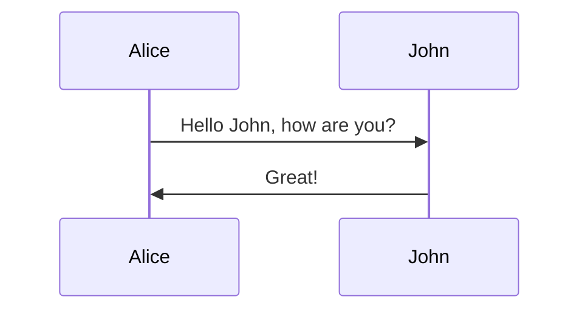
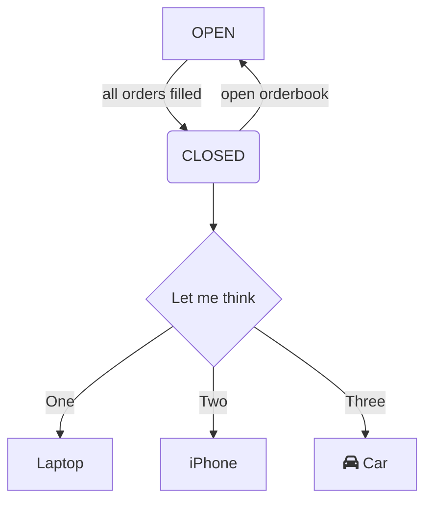

# json

```mermaid
sequenceDiagram
    participant A as Alice
    participant J as John
    A->>J: Hello John, how are you?
    J->>A: Great!
```    
    
    

```mermaid
graph TD
    A[OPEN] -->|all orders filled| B(CLOSED)
    B(CLOSED) -->|open orderbook| A[OPEN]
    B --> C{Let me think}
    C -->|One| D[Laptop]
    C -->|Two| E[iPhone]
    C -->|Three| F[fa:fa-car Car]
```  
